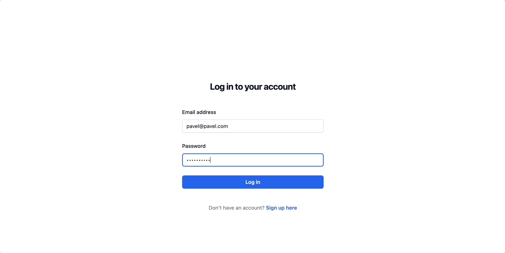
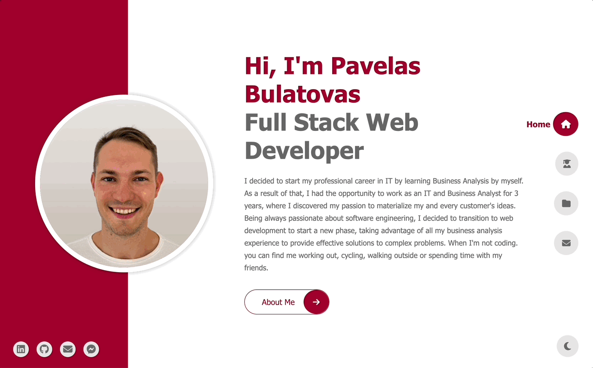

<h1 align="center">Hi 👋, I'm Pavelas Bulatovas</h1>
<h3 align="center">Software Engineer at @100Devs</h3>

  
  
  
  

Previously a Business Analyst, being always passionate about software engineering, I decided to transition to web development to start a new phase, taking advantage of all my business analysis experience to provide effective solutions to complex problems.

See [my website](https://pavelas-bulatovas.netlify.app) for more information!

<h1 align="center">Projects</h1>
<table bordercolor="#66b2b2">

  <!-- ==================== Row 1 -->

  <tr>
    <td width="50%" valign="top">
      <h3 align="center">Scuba Logger</h3>
         
        
         
        

          
    
  
      

        
<strong>EJS, Mongo, Node, Express, TailwindCSS</strong> - A full-stack web app that allows users to log their scuba diving experiences. Built using MongoDB, Express.js, EJS, and Node.js (MEEN stack). Styled with Tailwind CSS for a cohesive and responsive design.

    </td>
    <td width="50%" valign="top">
      <h3 align="center">Amazing Portfolio</h3>
         
        
         
        

          
    
  
      

        
<strong>React.js</strong> - A portfolio website encompasses various projects and experiments that demonstrate my skills and creativity, especially highlighting my React.js skills.

    </td>
    
  </tr>

  <!-- ==================== Row 2 -->

  <tr>
    <td width="50%" valign="top">
      <h3 align="center">Power Pulse Gym</h3>
         
        
         
        

          
    
  
      

        
<strong>HTML, CSS, Javascript</strong> - A website which is tailored to showcase the gym's facilities, services, and offer vital information to both potential and existing members.

    </td>
    
  <td width="50%" valign="top">
    <h3 align="center">Dream Travel</h3>
       
    
       
      

          
  
  
      

        
<strong>HTML, CSS, Bootstrap 5</strong> - Explore and discover the world's most exciting travel destinations on this interactive website.

    </td>
  </tr>

</table>

<h1 align="center">Connect</h1>

  
  
  
  

<h1 align="center">Languages and Tools:</h1>

 
  
  
  
  
  
  
  
  
  
  
  
  

